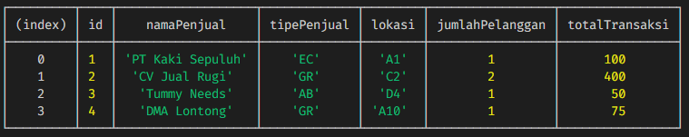

# Market & Consumer

__Durasi__: 120 Menit

Kalian adalah seorang *developer* yang berada pada sebuah perusahaan yang
mengelola pasar tradisional. Di sini Anda diminta untuk membuatkan sebuah
aplikasi berbasis **MVC** untuk memetakan lokasi dari para penjual 
dan melisting pelanggan tetap dari para penjual tersebut.

Sebagai patokan awal, sudah diberikan sebuah data dengan nama `penjual.json` yang
akan digunakan untuk membuat aplikasi pemetaan dan pencarian lokasi penjual.

## Release 1: Class
Diketahui bahwa Penjual di pasar tradisional itu memiliki beberapa `tingkat`
atau kasta penjualnya, yaitu:
- PenjualEceran
- PenjualGrosiran
- PenjualAbalAbal

Untuk **property** yang dimiliki oleh setiap Penjual, adalah
- `id` = menyatakan id keberapa Penjual tersebut
- `namaPenjual` = menyatakan nama Penjual (Toko)
- `tipePenjual` = menyatakan tipe Penjual yang mana
- `lokasi` = menyatakan lokasi Penjual tersebut berada di Pasar
- `maxPelanggan` = menyatakan jumlah maksimum pelanggan yang dapat dimiliki
- `listPelanggan` = menyatakan list data Pelanggan tetap

Tipe penjual ini dapat terlihat pada `penjual.json`, untuk setiap 
`tipe_penjual`-nya, yang dinyatakan dengan :
- `GR` untuk **Grosiran**, jumlah maksimum Pelanggan adalah 3
- `EC` untuk **Eceran**, jumlah maksimum Pelanggan adalah 2
- `AB` untuk **AbalAbal**, jumlah maksimum Pelanggan adalah 1

Untuk Pelanggan sendiri, memiliki **property** sebagai berikut:
- `namaPelanggan` = menyatakan nama Pelanggan
- `totalTransaksi` = menyatakan total transaksi dari si Pelanggan
- `idPenjual` = menyatakan Pelanggan ini terikat pada Penjual yang mana

## Release 2: Factory
Dikarenakan data classnya ada banyak sekali, maka tidak `sah` rasanya apabila
tidak ada factory methodnya, maka, cobalah untuk membuat sebuah class Factory
dengan nama `MarketFactory` yang didalamnya memiliki sebuah method dengan nama
`createMarket` yang akan digunakan untuk meng-*instantiate* semua class 
Penjual yang ada.

Hint:  
`Factory` boleh diletakkan pada folder `models`

## Release 3: List
Dengan menggunakan Konsep MVC, maka buatlah fitur pada aplikasi yang akan 
menerima input dari console seperti di bawah ini:

```javascript
node index.js listAll
```

Untuk menampilkan listing dari setiap Penjual beserta data Pelanggannya dalam
bentuk seperti berikut:


## Release 4: Add Penjual
Selanjutnya, buatlah fitur untuk menambahkan Penjual dengan syarat:
- `id` akan ditambahkan secara otomatis berdasarkan id terakhir +1
- `lokasi` untuk setiap Penjual tidak boleh ada yang sama

Input apabila benar:
```javascript
node index.js addPenjual "Toko Kelontong Ajaib" AB C3
```

Outputnya adalah sebagai berikut:
```javascript
Penjual Toko Kelontong Ajaib dengan id 5 berhasil ditambahkan
```

Input apabila salah (lokasi sudah ditempati):
```javascript
node index.js addPenjual "Toko Kelontong Ajaib" AB A1
```

Outputnya adalah sebagai berikut:
```javascript
Lokasi sudah ditempati oleh PT Kaki Sepuluh, gunakan lokasi lain
```

## Release 5: Add Pelanggan
Selanjutnya, buatlah fitur untuk menambahkan Pelanggan dengan syarat:
- `id` Penjual yang dimasukkan valid
- total Pelanggan yang dimiliki oleh Penjual tidak melebihi tipe Penjual 
  tersebut.

Input apabila benar:
```javascript
node index.js addPelanggan 1 "Fanta" 150
```

Outputnya adalah sebagai berikut:
```javascript
Pelanggan Fanta berlangganan pada Penjual PT Kaki Sepuluh
```

Input apabila salah (id Penjual tidak ditemukan):
```javascript
node index.js addPelanggan 100 "Fanta" 150
```

Outputnya adalah sebagai berikut:
```javascript
Penjual dengan id 100 tidak ditemukan
```

Input apabila salah (limit Pelanggan pada Penjual):
```javascript
node index.js addPelanggan 3 "Fanta" 150  
```

Outputnya adalah sebagai berikut:
```javascript
Penjual dengan id 3 sudah mencapai limit Pelanggan
```

## Release 6: Show Table Penjualan
Terakhir, kita akan membuat sebuah fitur untuk menampilkan data total transaksi
dari Penjual yang ada.


Input nya adalah sebagai berikut:
```javascript
node index.js showTablePenjual
```

Outputnya adalah sebagai berikut:  



Hint: ubah menjadi object literal !

## Selamat Mengerjakan !